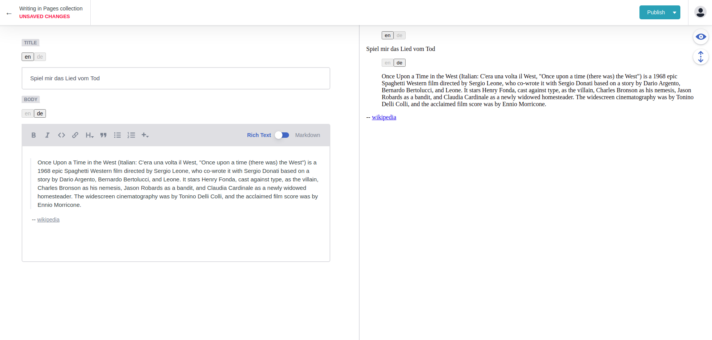

# netlify-cms-i18n
Add internationalization to netlify CMS.

Content is stored in json files in the repository.

## Installation
```shell
yarn add @netlify-cms-i18n/core
```

## Usage
Create and register localized versions of standard netlify-cms widgets:
```ts
import cms from 'netlify-cms-app'
import {
    createLocalizedWidget, Locale,
} from '@netlify-cms-i18n/core'

const LOCALES: Locale[] = ['en', 'de']

cms.getWidgets().forEach((widget) => {
    const { name, control, preview } = createLocalizedWidget(widget, LOCALES)
    cms.registerWidget(name, control, preview)
})

cms.init()
```

Localized widgets are available as `i18n-<widget>` in `static/config.yml`:
```yaml
collections:
  - label: Pages
    name: pages
    files:
      - label: Home
        name: home
        file: _data/home.json
        fields:
          - label: Title
            name: title
            widget: i18n-string
          - label: Body
            name: body
            widget: i18n-markdown
```

## Preview
