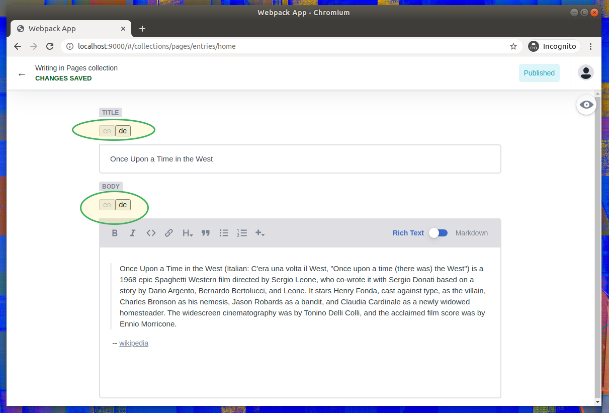

⚠️ Internationalisation (i18n) is now included in [Decap CMS](https://decapcms.org/docs/i18n/) (formally Netlify CMS).

Users of this plugin should use the built-in feature.

This repository will remain available for historical reference.

# netlify-cms-i18n (ARCHIVED)
Internationalisation (i18n) for netlify CMS.

Create widgets with ability to toggle between different locales.



## Installation
```shell
yarn add netlify-cms-app # peer dependency
```
```shell
yarn add netlify-cms-i18n
```

## Usage
The package provides a function `createLocalizedWidget` which takes a widget and a list of locales
and returns a localized (i18n) widget of the same type.

[Supported locales](packages/netlify-cms-i18n/src/i18n/locales.ts).

Create and register localized versions of standard netlify-cms widgets:
```ts
import cms from 'netlify-cms-app'
import { createLocalizedWidget, Locale } from 'netlify-cms-i18n'

const LOCALES: Locale[] = ['en', 'de']

cms.getWidgets().forEach((widget) => {
    const { name, control, preview } = createLocalizedWidget(widget, LOCALES)
    cms.registerWidget(name, control, preview)
})

cms.init()
```

Localized widgets are available as `i18n-<widget>` in your `admin/config.yml`:
```yaml
collections:
  - label: Pages
    name: pages
    files:
      - label: Home
        name: home
        file: _data/home.json
        fields:
          - label: Title
            name: title
            widget: i18n-string
          - label: Body
            name: body
            widget: i18n-markdown
```

## Development
Clone the repo and start the playground:

```shell
git clone https://github.com/EmCeeEs/netlify-cms-i18n.git
```
```shell
cd netlify-cms-i18n
```
```shell
yarn install
```
```shell
yarn start
```
